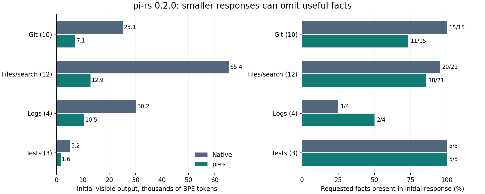

# Does pi-rs improve Codex? A measured comparison

Date: 2026-10-09. Tested: **pi-rs 0.2.0**, **Codex CLI 0.162.0**, on the
`prl-dev-vm` ARM Linux host.

## Finding

**pi-rs improved efficiency on the tested Codex task suite: 23.1% fewer total input
tokens, 8.9% fewer uncached input tokens, and the same 15/15 correct task results.**
Observed elapsed time fell 25.3%. The experiment includes its instruction overhead,
actual command choices, and recovery reads.

The benefit is conditional. Pi used more input in 6 of 15 matched pairs, including
18.2% more on the recent-history task. Command tests also found larger search
responses and missing facts. The evidence supports selective use; it does not
prove that every wrapper or every Codex workflow improves.

## 1. What was compared

Two experiments separate command behavior from complete agent behavior:

1. **Command comparison:** 29 cases using actual tools or file readers, plus five
   explicitly labeled subprocess replays. Every native/pi pair gets the same data.
   There are 21 randomized timing pairs per case after warm-up. Ground truth
   specifies the facts each task needs.
2. **Codex A/B sessions:** identical tasks, model and settings in isolated sessions;
   one arm receives the deployed pi-rs instructions. These runs measure actual
   agent choices, API-reported usage and answer correctness.

pi-rs is the local package described in [its provenance notes](../home/cli/pi-rs/NOTICE).
The installed binary resolves to
`/nix/store/72bp5wkb8qrjz0z60lzj5j029d86c4gn-pi-rs-0.2.0/bin/pi-rs`.
The benchmark records its SHA-256. Native commands run through Python argv
subprocesses so shell rewriting cannot accidentally turn the control into pi-rs.

### Codex already limits output

The [official prompting guide](https://developers.openai.com/cookbook/examples/gpt-5/codex_prompting_guide#tool-response-truncation)
describes middle truncation with a 10,000-token approximate budget. The pinned
[0.162.0 implementation](https://github.com/openai/codex/blob/c1382380de69521303b416720a52f42d51af6248/codex-rs/core/src/unified_exec/mod.rs)
uses that default, estimates one token as four bytes, and keeps the beginning and
end. We compiled its **unmodified Rust truncation helper**. Live tool probes at
explicit budgets of 100 and 10,000 matched its output byte for byte.

The benchmark applies this cap to **both arms** before counting tokens. Code Mode
has a distinct behavior: an omitted explicit cap exposes raw results to JavaScript,
which can filter them before returning content to the model. Our live probe
confirmed that too. The capped command comparison does not represent every
possible programmatic filtering strategy.

Counts below use actual `o200k_base` BPE tokenization, including pi-rs JSON
envelopes, recovery hints, and equal execution headers. This is a stated tokenizer
proxy, **not a claim about GPT-6 billing tokenization**. `cl100k_base` sensitivity
gives nearly identical aggregate results. Inference usage is measured separately.

## 2. Output savings and information loss

The primary sample excludes the five synthetic Docker/kubectl/npm/gh replays.
These are fixed fixture totals, not an estimate of a typical user's task mix.

| Metric, 29 cases | Native + Codex cap | pi-rs + Codex cap |
|---|---:|---:|
| Initial response tokens | 125,841 | 32,087 |
| Required facts initially visible | 41 / 45 | 36 / 45 |
| Extra targeted recovery calls | 4 | 8 |
| Facts available after recovery | 45 / 45 | 45 / 45 |
| Responses + commands + recovery + incremental instructions | 128,970 | 36,289 |

**Initial output fell 74.5%; initial fact availability fell from 91.1% to 80.0%.**
With targeted recovery and instructions counted once, this constructed sequence
still uses **71.9% fewer tokens**. That calculation excludes common task prompts,
model reasoning, repeated history billing and caching; it is not an API cost claim.
Native recovery optimistically assumes output was already saved, and both arms'
recovery queries know the target facts. The full agent experiment tests actual choices.

| Example | Native tokens | pi-rs tokens | What happened |
|---|---:|---:|---|
| Repeated log with one central error | 7,011 | 98 | 98.6% reduction; pi-rs retained an error hidden by native truncation |
| Source outline | 11,643 | 1,663 | 85.7% reduction; all three requested function names retained |
| Actual Cargo workspace tests | 4,088 | 960 | 76.5% reduction; success result retained |
| Recent Git history | 2,018 | 289 | 85.7% reduction; enough for the requested recent entries |
| Historical Git author/change | 2,018 | 289 | Same reduction, but both requested facts missing |
| Broad source search | 785 | 3,647 | **364.6% more tokens** from context, anchors and JSON metadata |
| Small directory listing | 57 | 79 | **38.6% more tokens** |
| Explicit compact Git history | 289 | 289 | No output saving |

The history example exposes a semantic change: bare `pi-rs git log` asks Git for
only 20 one-line entries. Omitted older commits and author metadata never enter
the wrapper, so a tee cannot recover them. A new explicit Git query is required.

### Native tools can already be concise

For 19 cases we also measured a hand-selected native query that answers the same
task using `rg`, `jq`, `--short`, `--oneline`, or `--quiet`:

| Initial response metric | Focused native query | pi-rs broad/default invocation |
|---|---:|---:|
| Tokens | 6,580 | 21,993 |
| Required facts visible | 32 / 32 | 24 / 32 |

Here pi-rs uses **3.34 times as many tokens**. This is an attainable native strategy,
not a claim that stock Codex always selects it. Examples: `git status --short`
matches pi-rs's compact small status output; `pytest -q` matches the passing test
output; a targeted `rg` query extracts the central setting in 36 response tokens.

### Sensitivity to Codex's output budget

| Approximate output budget | Native tokens | pi-rs tokens | Initial reduction |
|---|---:|---:|---:|
| 1,000 | 23,773 | 17,975 | 24.4% |
| 4,000 | 62,822 | 27,845 | 55.7% |
| 10,000 | 125,841 | 32,087 | 74.5% |

The savings depend strongly on the native cap. At the default cap,
`cl100k_base` measures 74.44% reduction versus 74.50% with `o200k_base`.
Budgets are four-byte estimates, so a capped response can contain more actual
BPE tokens than the nominal budget.

## 3. Costs beyond output size

**Instructions:** the deployed global rules add 634 `o200k_base` tokens (635 with
`cl100k_base`) to a fresh session. For this fixture, roughly eight bare small-status
calls or eleven default passing-pytest calls amortize that overhead, including the
extra command prefix. Starting with `git status --short` or `pytest -q` removes that
particular saving. Prompt caching and repeated turns change billed usage.

**Process overhead:** the median of the 29 cases' paired median overheads is
**1.70 ms**. Example paired medians: small Git status +3.89 ms, source summary
+7.76 ms, Cargo workspace tests +5.60 ms. The detailed tables include 95% bootstrap
intervals. These are warm command timings on one VM, not inference speedups.

**Streaming:** in a seven-run diagnostic replay lasting about 0.6 seconds, native
output delivered its first byte after a median **10.1 ms**; pi-rs delivered it after
**616.2 ms**, at completion. The wrapper also changed an interleaved
`stdout 1 → stderr 2 → stdout 3` sequence into `stdout 1 → stdout 3 → stderr 2`.
Its completed-process capture buffers and joins the streams. This matters for
long-running diagnostics and commands intended to stream indefinitely.

**Recovery:** three tested pi-rs full recovery reads still hid the requested target
after Codex applied its own cap: a timestamped log, a JSON payload, and the kubectl
log replay. Targeted queries succeeded. A blind full reread can therefore add tokens
without answering the task. For the medium file, the initial 1,506-token pi response
plus a 3,028-token full reread already exceeds the original 3,028-token native read.

**Storage:** the final command sample produced **308 tee files totaling 13,896,806
bytes** across warm-ups and measured invocations. Repeated-log compression wrote
the full 73,702-byte input on every invocation despite its 265-byte displayed
payload. These files are useful recovery artifacts and have a real storage cost.

All 34 native/pi command pairs preserved exit status, including the intentionally
failing pytest case. The evidence validator checks 87 stored output hashes and
verifies all 50 specified facts are available after recovery across both arms.

## 4. Isolated Codex task results

Five tasks × three repetitions × two arms produced **30 completed sessions**.
The requested model was `gpt-6.1-sol`, reasoning `medium`, using the user's existing
provider. Those settings were captured once and fixed for the entire matrix;
subsequent user configuration changes did not affect it. The provider's backend
routing was not independently verified.

Both arms retained Codex's built-in instructions and native tools. Personal
configuration, global/project guidance, hooks, skills, memory and external tools
were disabled or isolated. The pi arm alone received the actual global pi-rs rules.
Fresh mount namespaces masked `~/.codex` and pi-rs storage without modifying user
files or changing `HOME`/`CODEX_HOME`. Prompt audits verified zero copies of pi
guidance in stock, one in treatment, and no skills catalog in either.

This is a controlled comparison of native Codex against Codex with pi-rs guidance,
holding model and provider constant. It is not a test of every product's default
model, provider, plugins, or permissions.

| Metric, 15 sessions per arm | Native Codex | Codex + pi-rs | Change with pi-rs |
|---|---:|---:|---:|
| Exact task successes | 15 / 15 | 15 / 15 | Equal in this suite |
| Total input tokens | 603,610 | 463,965 | **−23.1%** |
| Cached input tokens | 392,910 | 272,025 | −30.8% |
| Uncached input tokens | 210,700 | 191,940 | **−8.9%** |
| Output tokens | 2,907 | 2,482 | −14.6% |
| Sum of elapsed session time | 173.6 s | 129.7 s | −25.3%, descriptive |
| Median session time | 10.99 s | 8.15 s | Descriptive |
| Completed command events | 37 | 37 | Equal |
| Commands reading pi tee files | 0 | 3 | Recovery included |

Usage is taken from the CLI's provider-reported cumulative turn usage, not the
command benchmark's tokenizer proxy. Input includes repeated history and cached
tokens. Cache writes were 210,559 versus 191,826 tokens and may have provider-specific
prices. Reasoning output is not added again to output totals. **No dollar saving is
inferred from these counts.**

| Task, three sessions per arm | Native input | pi-rs input | Total input reduction | Uncached input reduction |
|---|---:|---:|---:|---:|
| Diagnose repeated incident log | 76,816 | 69,638 | 9.3% | **−5.5%** |
| Find a regression in 120 changed configs | 178,339 | 115,937 | 35.0% | 33.5% |
| Look up a source policy | 125,956 | 87,995 | 30.1% | **−10.1%** |
| Diagnose a failing Rust test | 121,994 | 71,566 | 41.3% | 12.4% |
| Find the latest relevant Git change | 100,505 | 118,829 | **−18.2%** | **−6.8%** |

Negative reductions mean higher usage. Most of the absolute uncached-token benefit
came from the configuration-diff task; logs, source lookup and history used more
uncached input with pi-rs. Differences include command choice and batching as well
as compression. For example, stock often used a targeted `rg` on the incident log,
while all three pi diff runs needed a tee recovery read. The equal command-event
total does not imply equal numbers of model requests or equal output sizes.

A paired bootstrap within these five fixed tasks gives a **14.0%–30.4%** interval
for the aggregate total-input reduction. With only three repetitions per task,
this describes the observed suite's variability, not a general benefit across
software development. Provider caching and latency were not disabled. All tasks
were read-only investigations; equal results here do not establish better coding
accuracy, editing quality, or reliability on long tasks.

I independently rechecked the 30 raw transcripts against their expected answers,
usage totals and manifests. All six Rust sessions actually ran the test suite;
all 30 fixture source audits passed. No stock command invoked pi-rs. Four pilot
sessions and seven completed preliminary sessions remain archived but excluded.
One preliminary session was interrupted to correct a shared prompt that otherwise
forbade recovery-file reads. The accepted matrix reran all planned pairs with
equivalent recovery access. The initial pilot also exposed a tee-write permission
problem; both arms received the same storage permission before accepted runs.

Full [task results](../benchmarks/pi-rs/end-to-end/verified/results.md),
[transcripts and reproducible methodology](../benchmarks/pi-rs/end-to-end/README.md),
and [paired measurements](../benchmarks/pi-rs/end-to-end/verified/summary.json)
are included.

## 5. Recommendation

Use pi-rs selectively for repeated logs, large test/build output when completion
is sufficient, and source outlines when an outline answers the task. Prefer native
targeted search and concise native formats for narrow questions. Preserve explicit
history depth/format when investigating older changes, and use native streaming
for ongoing diagnostics.

The current blanket instruction to prefer every wrapper is broader than the
measured benefit. The complete-task experiment establishes a useful aggregate
improvement on this suite, including recovery overhead. The counterexamples make
**selective pi-rs guidance** a better-supported recommendation than mandatory use
for all reads, searches, listings, and Git commands.

## Reproduction and evidence

- [Harness and methodology](../benchmarks/pi-rs/README.md)
- [Every command result, timing interval, recovery and native alternative](pi-rs-command-details.md)
- [Raw command measurements](data/pi-rs-command-results.json)
- [Computed aggregates](data/pi-rs-command-summary.json)
- [Raw output, referenced tee files and live-probe archive](data/pi-rs-command-evidence.tar.gz)
- [Codex A/B harness](../benchmarks/pi-rs/end-to-end/run.py)

Final verification passed: all 30 transcript answers and usage records, 87 archived
command-output hashes, source integrity, instruction-isolation audits, report links,
and staged whitespace checks. The repository's Nix formatting, Statix, Deadnix,
flake evaluation and full `nix flake check` also passed.

Fixtures are deliberately varied and include adverse cases, but they are a curated
sample. Most file/log/Git fixtures are synthetic; source files are frozen real pi-rs
code, and Cargo runs the actual workspace. Replays do not establish live service
performance. Fact checks establish availability of specified evidence, not arbitrary
reasoning correctness. No dollar, universal accuracy, or universal speed claim follows
from the command compression percentages.
