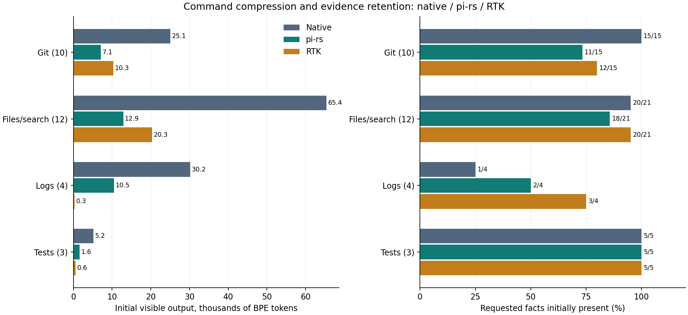

# Native Codex, pi-rs, and RTK: a measured comparison

Follow-up: [pi-rs 0.3 improvements and verified results](pi-rs-improvements.md).
The measurements below preserve the original pi-rs 0.2 comparison.

Date: 2026-10-09. Versions: **Codex CLI 0.162.0**, **pi-rs 0.2.0**,
**RTK 0.51.0**, on the `prl-dev-vm` ARM Linux host.

## Highlights

- **All three integrations solved all 15 tasks per arm correctly.**
- **pi-rs used 16.9% less total model input and 8.0% less uncached input than native.**
  RTK used **14.2% more total input**, but **6.5% less uncached input**. Total input
  includes cached history; these percentages are not dollar-cost estimates.
- **RTK was the stronger compressor in the command sample:** 75.0% less output
  and 40/45 required facts initially visible, versus pi-rs's 74.5% and 36/45.
  The complete-task comparison includes the integration overhead that command
  compression alone leaves out.
- RTK's official integration caused **15 additional awareness-document reads**,
  one per fresh session. Native used 38 command events, pi-rs 39, and RTK 55.
  This observed overhead matters for short tasks; the experiment does not isolate
  it as the sole cause of usage differences.

This report contains a **fresh three-way comparison**. The earlier 30-session
native/pi experiment is preserved in the [historical report](pi-rs-vs-codex-historical.md).
Its model totals are not pooled into these results.

## 1. Where pi-rs and its instructions come from

pi-rs is a local fork/toolbox with two upstream sources. Its command filters,
compression, and rewriting began from **RTK v0.40.0**; its AST functionality
derives from **oh-my-pi**. The current local version selectively incorporates
reviewed upstream improvements. It does not contain RTK's complete current
feature set or SQLite recovery service. The [provenance notes](../home/cli/pi-rs/NOTICE)
record those distinctions and the reviewed commits.

The pi-rs instruction block is installed as global `~/.codex/AGENTS.md` by
[home/cli/codex.nix](../home/cli/codex.nix), from
[agent-hooks/codex-rules.md](../home/cli/pi-rs/agent-hooks/codex-rules.md).
That explains why it can appear in a session even when the project's own
`AGENTS.md` has no pi-rs references. The installed Codex integration asks the
model to choose pi-rs commands through instructions.

RTK was tested using its unmodified, checksum-verified
[v0.51.0 release](https://github.com/rtk-ai/rtk/releases/tag/v0.51.0), commit
`e001f773f80b22b7dc4c7a79521b30e35aaef026`. Its official Codex integration uses
a PreToolUse hook to rewrite commands automatically and references a separate
awareness document. These are different usable integration bundles; complete-task
differences include their instructions and command choices as well as compression.

## 2. Fresh isolated Codex sessions

Five tasks × three repetitions × three arms produced **45 sessions**:
incident-log diagnosis, a regression among 120 changed configuration files,
source-policy lookup, a failing Rust test, and recent Git history.
Every arm used requested model **`gpt-6.1-sol`, medium reasoning**, with provider
settings captured once. Execution order rotated so each arm occupied each position
once per task. Backend routing was not independently verified.

| Metric, 15 sessions per arm | Native Codex | Codex + pi-rs | Codex + RTK |
|---|---:|---:|---:|
| Exact task successes | 15 / 15 | 15 / 15 | 15 / 15 |
| Total input tokens | 583,172 | 484,777 | 666,064 |
| Cached input tokens | 364,498 | 283,577 | 461,546 |
| Uncached input tokens | 218,674 | 201,200 | 204,518 |
| Output tokens | 3,441 | 2,684 | 3,509 |
| Sum of session time, seconds | 160.0 | 132.8 | 172.5 |
| Median session time, seconds | 10.3 | 7.6 | 11.7 |
| Completed command events | 38 | 39 | 55 |
| Reads of recovery outputs | 0 | 4 | 0 |
| Awareness-document reads | 0 | 0 | 15 |

Compared directly with pi-rs, RTK used **37.4% more total input and 1.65% more
uncached input**. Pi used less total input than native in 9/15 matched pairs;
RTK did so in 4/15. RTK beat pi on total input in 1/15 pairs. The observed sum
of session times was 17.0% lower for pi and 7.8% higher for RTK than native.

Paired bootstrap intervals within these five fixed tasks were **2.0%–28.4% less
total input for pi versus native**, and **8.8%–20.3% more for RTK versus native**.
These describe this small suite's variation, not a production-workload guarantee.

### Which tasks changed the result?

| Task, three sessions per arm | Native input | pi-rs input | RTK input |
|---|---:|---:|---:|
| Diagnose an incident log | 88,162 | 69,561 | 122,738 |
| Find the configuration regression | 173,998 | 148,530 | 180,591 |
| Look up a source policy | 112,231 | 88,034 | 126,607 |
| Diagnose a failing Rust test | 107,521 | 71,444 | 100,313 |
| Find the latest relevant Git change | 101,260 | 107,208 | 135,815 |

Pi reduced total input on four of five task totals; recent history used **5.9%
more**. RTK reduced total input only on the Rust-test task (**6.7% less**).

Uncached input tells a different story. Both wrappers saved most on configuration
diffs and failing tests. RTK used **18.6% less uncached input** on the Rust task,
versus pi's **12.0% reduction**. Both used more uncached input for log diagnosis
and source lookup. The model can select a concise native query before any wrapper
has a chance to help.

Pi made four tee recovery reads, all on the configuration-diff task. RTK's Rust
runs stored recall entries but needed no recall command to solve the task. RTK
diff sessions used targeted reads or diff flags; one Python heredoc correctly
bypassed rewriting and inspected native Git output.

### What the RTK integration actually did

RTK's official `rtk init -g --codex` setup ran inside fresh temporary mounts.
Its actual `rtk hook codex` hook was enabled, with default awareness, tracking,
and SQLite recovery. Native and pi sessions had no RTK hook. Identical temporary
mounts masked user configuration and storage for all arms without changing `HOME`
or `CODEX_HOME`. Model sessions chose their own commands and batching.

RTK initially contributes a **14-token file reference**; its installed awareness
file contains **127 o200k tokens**, including its ownership header. Codex did not
automatically inline that file in the instruction audit. The pi integration
provides **634 tokens inline**. Actual model input includes any document reads
and subsequent repeated history; these document sizes alone do not predict usage.

Every RTK session explicitly read that awareness file. Of RTK's 55 command events,
**52 contained RTK commands**, and its history recorded **62 subprocesses**;
compound calls can contain several subprocesses. All **48 intact hook rewrite
records** matched executed shell commands exactly, and there were three intact
skip records. Two audit records merged concurrent log writes, each obscuring two
rewrites; the raw logs are preserved and parsed rewrite totals are lower bounds.
The executed-command and SQLite records independently confirm those RTK calls.
No RTK hook/history activity occurred in native or pi sessions.

All three arms allowed recovery and installed-instruction reads. Skills, memories,
external tools, personal configuration, and unrelated hooks were disabled or
isolated. RTK's known hook used the CLI hook-trust bypass in its temporary state;
the command sandbox and ordinary approval checks remained enabled.

Provider-reported total input includes cached and repeated context. Uncached
input is total minus cached input; cache writes are archived separately. No dollar
saving is inferred. The suite contains only five fixed read-only investigations,
with three repetitions each. Equal answers here do not establish editing quality
or reliability on long development tasks. Timing includes provider latency and
caching and is descriptive.

## 3. Command compression and missing facts

The command experiment reran all three arms on identical regenerated fixtures:
**29 actual-tool/file-reader cases**, plus five separately reported synthetic
Docker/kubectl/npm/gh replays. Each variant had one warm-up and **21 timing
repetitions**, in randomized serial order. Native commands were invoked with
Python argv subprocesses so shell rewriting could not contaminate the control.

| Metric, 29 primary cases | Native | pi-rs | RTK |
|---|---:|---:|---:|
| Initial visible output tokens | 125,843 | 32,104 | 31,415 |
| Reduction from native | — | 74.5% | 75.0% |
| Required facts initially visible | 41 / 45 | 36 / 45 | 40 / 45 |
| Extra targeted recovery calls | 4 | 8 | 5 |
| Facts after recovery | 45 / 45 | 45 / 45 | 45 / 45 |
| Responses + commands + targeted recovery | 128,977 | 35,681 | 34,646 |

**RTK uses 2.1% less initial output than pi-rs and preserves four more specified
facts in this sample.** The aggregate masks large differences by command family.
The last row excludes instruction documents, model reasoning, repeated history,
and cache effects. Recovery queries know the exact targets; native recovery also
optimistically assumes its output was already saved. These are attainable command
strategies, not observed agent decisions or API-cost estimates.

| Example | Native tokens | pi-rs tokens | RTK tokens | What matters |
|---|---:|---:|---:|---|
| Timestamped log with a central error | 16,052 | 3,269 | 89 | RTK retains the request identifier; the other initial responses omit it |
| Actual Cargo workspace tests | 4,088 | 966 | 41 | All retain the success fact; RTK reduces output to a test summary |
| Broad source search | 785 | 3,647 | 478 | pi-rs expands output through context, anchors, and JSON metadata |
| Source outline | 11,643 | 1,663 | 1,998 | Both retain the three requested function names |
| Medium file read | 3,028 | 1,507 | 3,028 | pi-rs omits the central setting; RTK's default read keeps full content |
| Large configuration diff | 14,321 | 507 | 4,320 | Both wrappers omit the specific unsafe change |
| JSON record lookup | 12,797 | 921 | 65 | All three initially omit the requested middle record |
| Small directory listing | 57 | 79 | 81 | Both wrappers expand the response |

RTK's bare Git log defaults to **10 entries with author information**; pi-rs
defaults to **20 one-line entries**. RTK therefore misses a requested twentieth
recent entry, while pi-rs's historical query also loses author metadata. Neither
default supplies older commits that were never fetched. Explicit compact Git
history, Git numstat, and the machine-readable kubectl JSON replay were byte-identical
to native output in both wrappers.

### Focused native queries remain useful

For 19 cases, task-specific native flags or queries produced **6,580 tokens with
32/32 facts**, compared with pi-rs's **22,008 tokens and 24/32 facts**, and RTK's
**21,596 tokens and 28/32 facts** on their broader invocations. These queries use
`rg`, `jq`, `--short`, `--oneline`, and `--quiet`. They represent an efficient
available strategy; the model experiment measures whether agents choose it.

## 4. Codex's own cap, overhead, and recovery

### Codex already truncates output

The command benchmark compiles the unmodified Rust truncation helper from
[Codex 0.162.0](https://github.com/openai/codex/blob/c1382380de69521303b416720a52f42d51af6248/codex-rs/utils/string/src/truncate.rs)
and applies the same cap to every arm. Its default budget is 10,000 approximate
tokens, estimated as four bytes each, keeping the beginning and end. Earlier live
probes at explicit budgets of 100 and 10,000 matched that helper byte for byte.

Actual visible text is counted with `o200k_base`, including execution headers,
wrapper envelopes, and recovery hints. This is a tokenizer proxy, not a claim
about GPT-6 billing. `cl100k_base` gives similar savings: **74.43% for pi-rs and
75.10% for RTK**. Code Mode can expose uncapped output to JavaScript when no
explicit cap is supplied; callers can filter before returning content to the
model. This experiment does not model every programmatic filtering strategy.

| Codex approximate output budget | Native tokens | pi-rs tokens | RTK tokens | pi-rs / RTK reduction |
|---|---:|---:|---:|---|
| 1,000 | 23,773 | 17,987 | 12,930 | 24.3% / 45.6% |
| 4,000 | 62,824 | 27,862 | 24,341 | 55.7% / 61.3% |
| 10,000 | 125,843 | 32,104 | 31,415 | 74.5% / 75.0% |

### Process overhead and streaming

The median across primary cases of paired command overhead was **+0.86 ms for
pi-rs** and **+4.53 ms for RTK**. These are warm VM measurements, with per-case
bootstrap intervals in the detailed table. Direct-command timing excludes hook
execution; model-session timing includes the installed integration. These small
local timing differences do not establish inference speedups.

In a seven-repetition Cargo-shaped stream lasting about 0.6 seconds, first output
arrived at median **5.6 ms native, 610.3 ms pi-rs, and 610.8 ms RTK**. Both wrappers
buffered until completion. In the original arbitrary-diagnostic replay, pi-rs
returned all three lines at completion and RTK returned **empty output with exit
code 0**. RTK's first-byte measurement is null for that case; the original EOF
measurement is retained separately. The generic replay is preserved alongside
the supplemental Cargo-shaped probe.

The interleaved generic stream also exposed pi-rs joining stdout before stderr,
changing `1 → 2 → 3` into `1 → 3 → 2`. RTK omitted that replay's diagnostics.
These findings support using native execution when immediate or arbitrary
diagnostic output matters.

### Recovery and storage

pi-rs wrote **308 tee files totaling 13,896,806 bytes** across the command sample's
warm-ups and timing repetitions. RTK's final persistent databases occupied
**286,720 bytes**, including history; five unique recovery entries held 10,550 raw
bytes in 2,073 bytes of compressed blobs. These figures reflect different coverage:
pi-rs preserves more complete outputs repeatedly, while RTK stores fewer payloads
in this sample. They do not demonstrate equivalent recovery guarantees.

All four recovery hashes advertised in initial RTK responses returned the stored
payload byte for byte in a separate audit. However, the five primary RTK cases
missing facts offered no SQLite recall hint for those losses: recovery required
a new native query. The diff did offer its own `--no-compact` rerun hint. RTK's
JSON summary and unclassified long-line log summary did not offer recall hints
for their omitted target content.

For pi-rs, a full tee reread still lost the target after Codex's cap in the
timestamped log and JSON cases, plus the synthetic kubectl log replay. Targeted
reads succeeded. A recovery file preserves evidence on disk; a blind full reread
does not guarantee that the model sees it.

## 5. Recommendation

For these short investigative tasks, the deployed **pi-rs integration had the
best measured complete-task efficiency**, with equal correctness. RTK's stronger
command summaries did not outweigh its integration and model-interaction costs
on total input in this suite. Its uncached-input usage was close to pi's, so the
total-input difference should not be read as an equivalent price difference.

RTK's timestamp-aware log grouping, compact test summaries, and lighter search
output are useful features to consider when evolving pi-rs. Pi-rs produced smaller
source outlines here. Both tools benefit from explicit Git history depth and
format, targeted recovery, and native execution for streaming diagnostics.

Use compression selectively. Native task-specific `rg`, `jq`, and compact Git
formats remain effective, and blanket wrapper preference is broader than the
measured benefit. The awareness-read cost may amortize differently in longer RTK
sessions; that scenario was not measured. These results do not justify replacing
the current integration solely because RTK advertises a higher compression rate.

## Evidence and reproduction

- [Command harness and methodology](../benchmarks/pi-rs/README.md)
- [Every command, fact check, recovery, and timing interval](pi-rs-rtk-command-details.md)
- [Raw command measurements](data/pi-rs-rtk-command-results.json)
- [Computed command aggregates](data/pi-rs-rtk-command-summary.json)
- [Raw output, tee files, SQLite databases, and pinned-source evidence](data/pi-rs-rtk-command-evidence.tar.gz)
- [45-session results](../benchmarks/pi-rs/end-to-end/three-way/results.md)
- [Model integration and isolation methodology](../benchmarks/pi-rs/end-to-end/THREE_WAY.md)
- [Model transcripts, usage, and manifests](../benchmarks/pi-rs/end-to-end/three-way/manifest.json)
- [Historical native/pi report](pi-rs-vs-codex-historical.md)

Command validation rechecked **121 initial output hashes**, token counts at all
three caps, recovery payloads, and all 34 exit-code triples. All 50 specified
facts across primary cases and replays were available after measured recovery
in every arm. Semantic checks accept narrowly defined formatting equivalents
for Cargo success and JSON's `total: 500`, consistently across all arms.

All 45 raw transcript answers and provider usage records were independently
rechecked. All 45 fixture-integrity checks passed, and all nine Rust sessions
actually ran the required failing tests. Initial instruction audits passed for
all three arms. The only RTK error-type startup events were the two known
hook-trust notices per session; no unexpected error events occurred. Raw audit
log corruption is disclosed above. The three feasibility-pilot sessions remain
archived and excluded. The command archive separately passed 149 payload-hash
checks across initial, targeted-recovery, and recall-audit outputs.

The fixtures are curated and deliberately include adverse cases. Many file/log/Git
inputs are synthetic; source inputs are frozen real code, and the Cargo workspace
and pytest runs are real. Replays do not establish live service performance.
Aggregate compression percentages depend on this workload mix and output budget.
